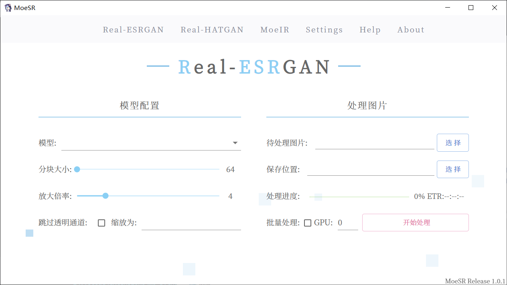

# MoeSR

## 更新日志

v1.1.0: 

> Update：优化进度条显示，更加平滑
>
> Update：支持自定义输出文件名格式，支持记忆常用选项，支持输出留空并自动保存到相对文件夹中
>
> Update：添加工作流功能，支持推理，缩放，长宽条件判断等节点
>
> Update：支持FP16模型（MoeIRv1.1-fp16）,IR 1.1支持对中度压缩，缩放，伪影的修复

v1.0.2: 

> Fix：修复ResizeTo未生效问题
>
> Update：调整UI，简单模式+高级设置；选择图片或文件夹更加方便，无需切换批处理模式；添加根据目标分辨率自动决定倍数与缩放分辨率功能；GPU支持按名称选择（实验功能）

v1.0.1: 

> Fix：修复进度计算错误
>
> Update：优化重名文件重命名方式，更新图像切片处理算法，添加MoeIR图像恢复模型，迁移webui至vite
>
> Other Update：精简readme，更专注于使用相关的内容

v1.0.0: 正式版发布

## 关于

MoeSR是一个专注于插画，CG，漫画等ACGN领域图像超分辨率与图像恢复工具，基于改进或自研的深度学习方法，对细节质量与清晰度有更贴近原图的表现。目标是追求更好的SR与IR效果。

软件截图：

## 如何使用

1. 从旁边的Release处下载压缩包，解压后打开`启动.bat`即可，无需安装依赖。
2. 软件导航栏上有帮助(Help)，可点击查看更详细的说明。

### 模型比较

| 模型名称                                | 描述                                                         |
| --------------------------------------- | ------------------------------------------------------------ |
| Real-ESRGAN-x4: Anime6B-Official        | RealESRGAN官方提供的动画插画模型                             |
| Real-ESRGAN-x4: jp_Illustration-fix1    | 适用于日系插画，一般修复强度（去模糊，JPEG还原），模型适当自由发挥 |
| Real-ESRGAN-x4: jp_Illustration-fix1-d  | 适用于日系插画，一般修复强度，保留更多细节                   |
| Real-HATGAN-x4: jp_Illustration-fix1    | 适用于日系插画，一般修复强度                                 |
| Real-HATGAN-x2: universal-fix1          | 适用于各种风格的2d插画，一般修复强度                         |
| Real-HATGAN-x1: jp_Illustration-fixonly | 适用于日系插画，仅修复图片，不进行放大                       |
| Real-HATGAN-x2: jp_Illustration-fix1    | 适用于日系插画，一般修复强度                                 |
| MoeIR: MoeIRv1                          | 高效的图像恢复模型，对被压缩的图像（如X，Pixiv上的jpg等）有很好的恢复效果 |
| MoeIR: MoeIRv1.1                        | 相对v1更强大的图像恢复模型，支持对中度压缩，缩放，伪影的修复（可能对轻度压缩视频也能修复，还未测试） |

注：MoeIR为测试模型，暂未公开发放

## 开源协议外的附加条款

1. 禁止以任何形式贩卖本软件以及其中的模型（请尊重劳动成果）
2. 禁止在用户不知道此软件能免费使用的情况下使用本软件及模型提供付费超分辨率服务
3. 软件为开源项目且在本地运行，发布后开发者无法管理。用户使用产生的任何纠纷/法律问题等自行解决，与开发者无关。

## 支持本项目

如果你觉得此项目不错，能帮助到你，可以给一个Star。

如果想赞助本项目可到：https://afdian.com/a/luo_yi

## 开发&构建

暂无文档，后期打算重构（如果还能继续维护此项目）。

## 参考与引用

超分辨率算法：

- Real-ESRGAN: https://github.com/xinntao/Real-ESRGAN
- HAT: Hybrid Attention Transformer for Image Restoration: https://github.com/XPixelGroup/HAT

图像恢复算法：

- UFormer: https://arxiv.org/abs/2106.03106

其他：

- Eel: https://github.com/python-eel/Eel

- 默认图标来自： 《ハミダシクリエイティブ》中的角色 "錦 あすみ"

- UI 美术风格参考：

  『アインシュタインより愛を込めて』オフィシャルウェブサイト：https://glovety.product.co.jp/

